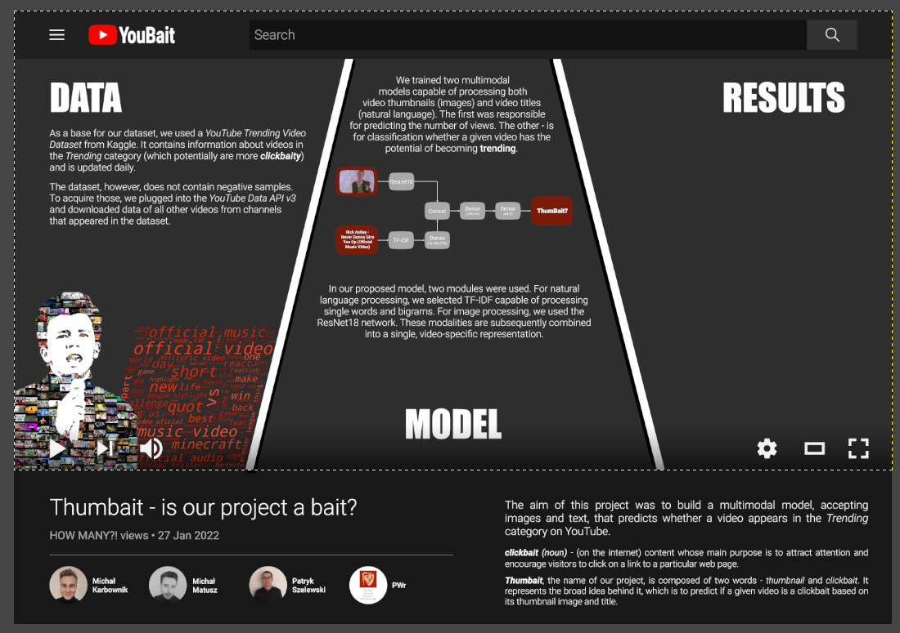

# Thumbait - is our project a bait?

The aim of this project was to build a multimodal model, accepting images and text, that predicts whether a video appears in the Trending category on Youtube.

## Install
You use this command to app run this locally with docker-compose:
docker-compose -p thumbait -f azure.yml up

*azure.yml* uses images shared on Docker Hub:

docker pull thumbait_main-server pszelew/thumbait-backend:latest
docker pull thumbait_streamlit-app pszelew/thumbait-frontend:latest

## Both backed and frontend are available as docker packages

docker pull

## Models

Models trained by us are available on gdrive:
[Models](https://drive.google.com/drive/folders/19iDtiejsrstW8Zk1qlb_4nRtPlUsFHtm?usp=sharing)
